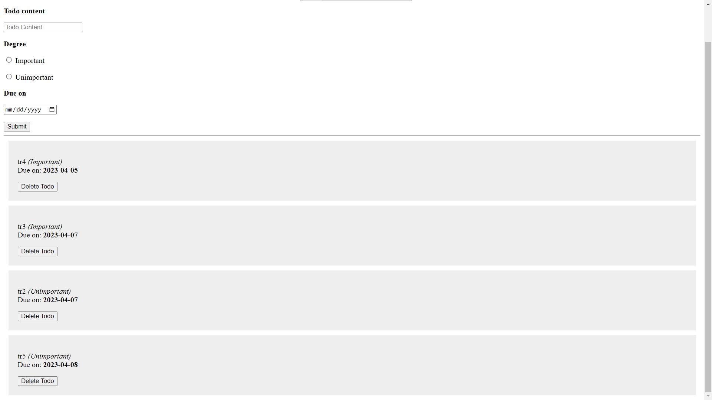

# BSC Web Dev BackEnd CA4 - Antonin Suzor

This simple repo is my handout for my CA4.
It consists of a TODO app, created in Flask, with a MongoDB database.

### Extension of the base app
I extended the base TODO app by adding a date field to the tasks, and by sorting the tasks displayed:
* The important tasks are displayed first, then come the unimportant ones.
* In both categories, the tasks which deadlines are the closest will come up first as well.

##### Please Note:
The app may not work if you try it on you own. I have commented out the line that connects to the database, and I removed personal information such as my username and password.

### Opinion of Flask ?
Before this CA, we had only worked with Django. And it was... Complex, compared to what is needed for Flask.
In Flask, the file architecture is simple, only a handful of files are required for a small website, and the code feels more understandable and natural.
Overall, I think that I have my preference set for Flask.
